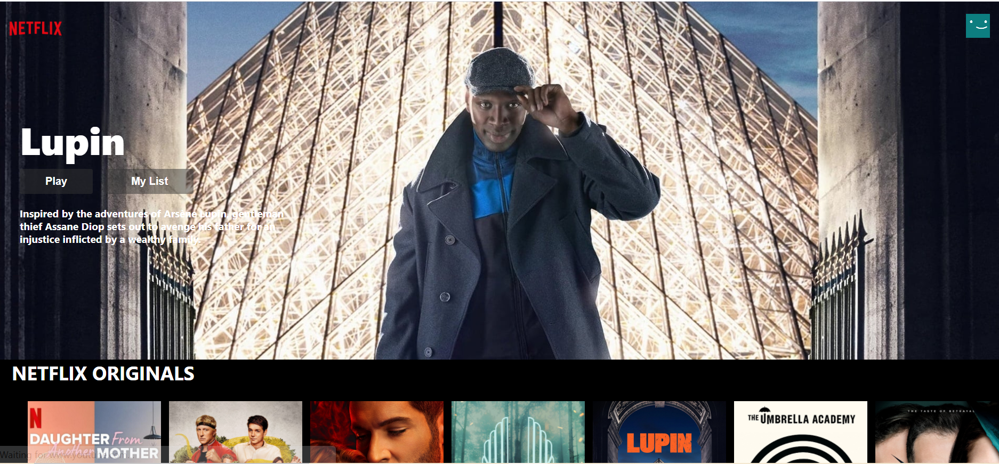
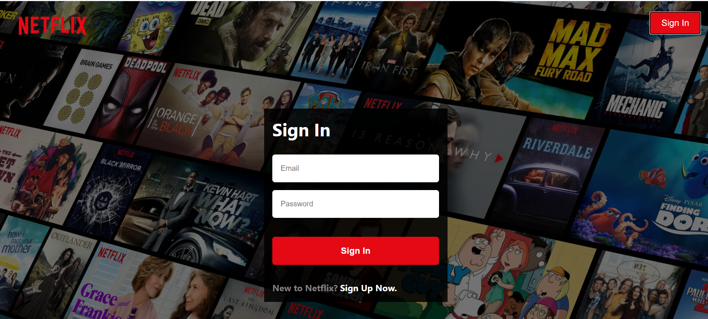

# React NetflixClone
Made a Netflix Clone using TMDb Api with complete Firebase authentication along with the feature of viewing movie trailers using npm movie trailer and react-youtube library.

# Motivation
The main reason behind this project was to use my React skills into application for building a real-world project. I learnt a lot while working on this project and understood how various things are integrated while working on real-world applications.

# Screenshots
<h1>Homepage</h1>

<h1>SignUp Page</h1>

# Tech/framework used
1. Reactjs
2. Firebase

# Features
1. Complete SignIn/SignUp Authentication using Firebase
2. Viewers will be able to view trailers on clicking image icons

# API Reference
Used TMDb Api for obtaining all the movie details https://www.themoviedb.org/
